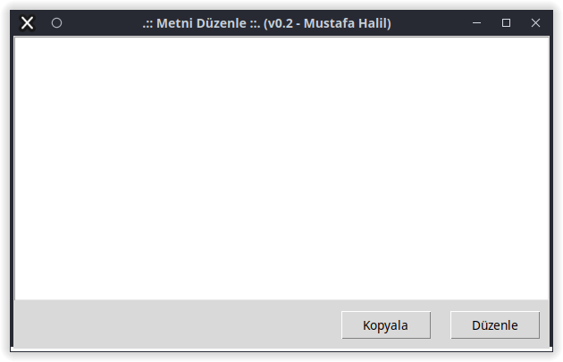

# Metni_Düzenle

PDF dosyalarından, web sayfalarından, ...vb kaynaklardan kopyaladığımız metinleri Libre Ofis Writer, Microsoft Word, Gedit, Not Defteri, ...vb metin düzenleme  uygulamalarına yapıştırdığımız zaman, metinlerin satır yapısının, kaynaktan kopyalandığı gibi olduğunu görürüz. 

## v0.1
Örnek bir **PDF** dosyası ve kopyalanan metnin **gedit** içerisine yapıştırıldığında karşılaştığımız sonuç aşağıdaki resimlerde görüntülenmektedir.


Kopyalanıp yapıştırılan metnin satır verileri, PDF dosyasındaki içerikle ile aynı ve aynı sayıda karakter içeriyor.   Toplam 20 satır veri var.


Metni bu şekilde kopyalayarak Tercüme (translate) uygulamalarına yapıştırısak, cümle bütünlüğü sağlanmadığı için yanlış tercüme elde ederiz. Bizim yapmak istediğimiz şey, bu içerikteki satırları ardarda getirme, "varsa" bir kısmı alt satıra taşmış kelimeleri birleştirmek ve her bir cümleyi ayrı bir satıra gelecek şekilde düzenleyen python kodunu yazmak.

> Kodun doğru çalıması için;
> 
> Düzenlemek istediğiniz metni, kod ile aynı klasöre (dizine), **metin.txt** ismi ile kaydedin ya da kod içerisindeki `txt_dosya = "metin"` kısmını değiştirin.

Kodu çalıştırdığınızda, aynı dizin (klasör) içerisinde **metin_duzenlendi.txt** isminde yeni bir dosya oluşturulacaktır. İçerik, toplam 13 satır veri (cümle) haline geldi.


**metin_duzenlendi.txt** dosyasını incelerseniz, içerikteki bir kısmı alt satıra taşmış kelimelerin birleştirildiğini ve her bir cümlenin ayrı bir satıra gelecek şekilde düzenlendiğini görebilirsiniz.

Gedit programının yatay boyutunu artırsak ta cümle bütünlüğünün korunduğunu görebiliriz. Metni bu şekilde kopyalayarak Tercüme (translate) uygulamalarına yapıştırısak, cümle bütünlüğü sağlanmış olur.


## v0.2
### tkinter ;
v0.2 sürümünde, **tkinter, ttkbootstrap** ve **pyperclip** kütüphanleri kullanılarak programa görsel arabirim eklendi.



Bu sürümde, örnek metni kopyalayın, uygulamayı çalıştırıp **Düzenle** butonuna basın. Düzenlenmiş metin, uygulamadaki metin kutusuna eklenecektir. Bu sürümde her cümle ayrı bir satıra gelecek şekilde **düzenlenmedi.**

Düzenlenmiş metni panoya kopyalamak için **Kopyala** butonuna basmanız yeterlidir.


### ttkbootstrap ;
örnek metni kopyalayın, uygulamayı çalıştırıp **Panodaki Metni Düzenle** butonuna basın. Düzenlenmiş metin, uygulamadaki metin kutusuna eklenecektir.


Metnin Düzenlenmiş Hali;

Düzenlenmiş metni panoya kopyalamak için **Düzenlenmiş Metni Kopyala** butonuna basmanız yeterlidir.


## v0.4
Bu sürümde;
* Fazla boşluk ve tab sekme mesafeleri ayarlandı,
* Paragraf yapıları, orijinal metne uygun şekilde ayarlanmaya çalışıldı, 
* Uygulama arabirimindeki iki buton yerine tek buton kullanımı tercih edildi. Artık tek butona basılınca metin düzenlenecek ve düzenlenmiş metin panoya kopyalanacak.

**Örnek metin;**
```
	2.1 Python Nedir?
			Tahmin edebileceğiniz gibi Python (C, C++, Perl, Ruby ve benzerleri gibi) bir program-
lama dilidir ve tıpkı öteki programlama dilleri gibi, önünüzde duran kara kutuya, yani bilgisayara
hükmetmenizi sağlar.
		   Bu programlama dili Guido  Van   Rossum adlı Hollandalı bir programcı tarafından 90’lı yılların
başında geliştirilmeye başlanmıştır. Çoğu insan, isminin Python olmasına aldanarak, bu program-
lama dilinin, adını piton yılanından aldığını düşünür. Ancak zannedildiğinin aksine bu programlama
dilinin adı piton yılanından gelmez. Guido Van Rossum bu programlama dilini, The Monty Python
adlı bir İngiliz komedi grubunun, Monty Python’s Flying Circus adlı gösterisinden esinlenerek adlan-
dırmıştır. Ancak her ne kadar gerçek böyle olsa da, Python programlama dilinin pek çok yerde bir yılan
figürü ile temsil edilmesi neredeyse bir gelenek halini almıştır (65)
	           Dediğimiz gibi, Python bir programlama dilidir. Üstelik pek çok dile kıyasla öğrenmesi ko-
lay bir programlama dilidir. Bu yüzden, eğer daha önce hiç programlama deneyiminiz
olmamışsa, programlama maceranıza Python’la başlamayı  tercih edebilirsiniz;
	Python'ın İyi bir başlangıç olacağından hiç şüphem yok.
```

Yukarıdaki örnek metni, v0.4 sürümü ile düzenlemeye çalıştığımda aşağıdaki ekran görüntüsündeki sonucu elde ettim.
