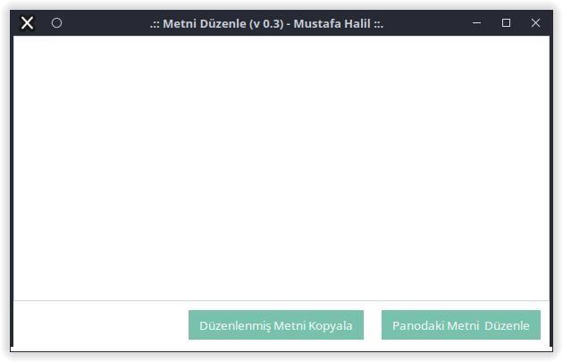
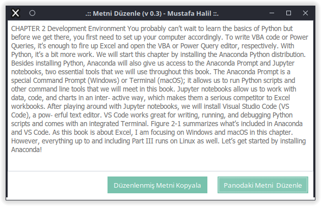

# Metni_Düzenle

PDF dosyalarından, web sayfalarından, ...vb kaynaklardan kopyaladığımız metinleri Libre Ofis Writer, Microsoft Word, Gedit, Not Defteri, ...vb metin düzenleme  uygulamalarına yapıştırdığımız zaman, metinlerin satır yapısının, kaynaktan kopyalandığı gibi olduğunu görürüz. 

## v0.1
Örnek bir **PDF** dosyası ve kopyalanan metnin **gedit** içerisine yapıştırıldığında karşılaştığımız sonuç aşağıdaki resimlerde görüntülenmektedir.

Kopyalanıp yapıştırılan metnin satır verileri, PDF dosyasındaki içerikle ile aynı ve aynı sayıda karakter içeriyor.   Toplam 20 satır veri var.

Metni bu şekilde kopyalayarak Tercüme (translate) uygulamalarına yapıştırısak, cümle bütünlüğü sağlanmadığı için yanlış tercüme elde ederiz. Bizim yapmak istediğimiz şey, bu içerikteki satırları ardarda getirme, "varsa" bir kısmı alt satıra taşmış kelimeleri birleştirmek ve her bir cümleyi ayrı bir satıra gelecek şekilde düzenleyen python kodunu yazmak.

> Kodun doğru çalıması için;
> 
> Düzenlemek istediğiniz metni, kod ile aynı klasöre (dizine), **metin.txt** ismi ile kaydedin ya da kod içerisindeki `txt_dosya = "metin"` kısmını değiştirin.

Kodu çalıştırdığınızda, aynı dizin (klasör) içerisinde **metin_duzenlendi.txt** isminde yeni bir dosya oluşturulacaktır. İçerik, toplam 13 satır veri (cümle) haline geldi.

**metin_duzenlendi.txt** dosyasını incelerseniz, içerikteki bir kısmı alt satıra taşmış kelimelerin birleştirildiğini ve her bir cümlenin ayrı bir satıra gelecek şekilde düzenlendiğini görebilirsiniz.

Gedit programının yatay boyutunu artırsak ta cümle bütünlüğünün korunduğunu görebiliriz. Metni bu şekilde kopyalayarak Tercüme (translate) uygulamalarına yapıştırısak, cümle bütünlüğü sağlanmış olur.

## v0.2
### tkinter ;
v0.2 sürümünde, **tkinter, ttkbootstrap** ve **pyperclip** kütüphanleri kullanılarak programa görsel arabirim eklendi.

Bu sürümde, örnek metni kopyalayın, uygulamayı çalıştırıp **Panodaki Metni Düzenle** butonuna basın. Düzenlenmiş metin, uygulamadaki metin kutusuna eklenecektir. Bu sürümde her cümle ayrı bir satıra gelecek şekilde düzenlenmedi.

Düzenlenmiş metni panoya kopyalamak için **Düzenlenmiş Metni Kopyala** butonuna basmanız yeterlidir.

### ttkbootstrap ;

Metnin Düzenlenmiş Hali;

